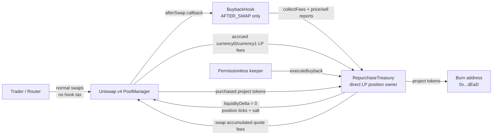
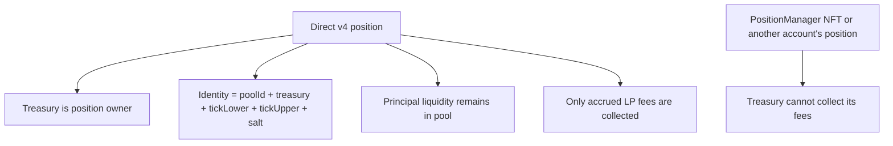
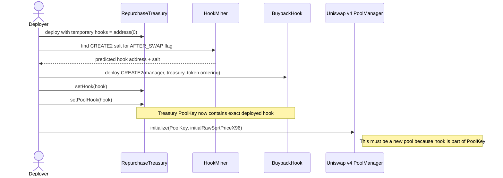
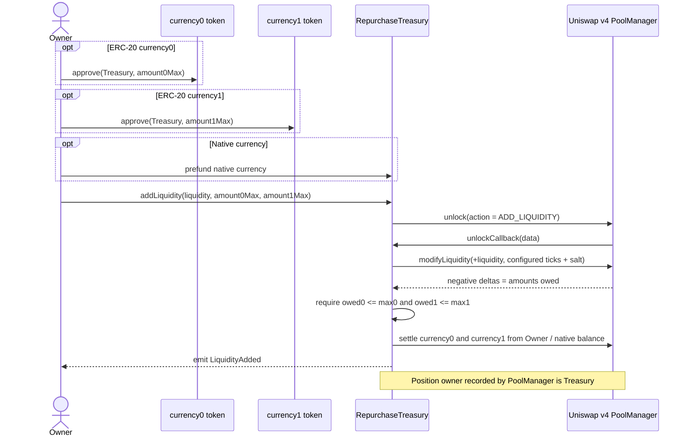
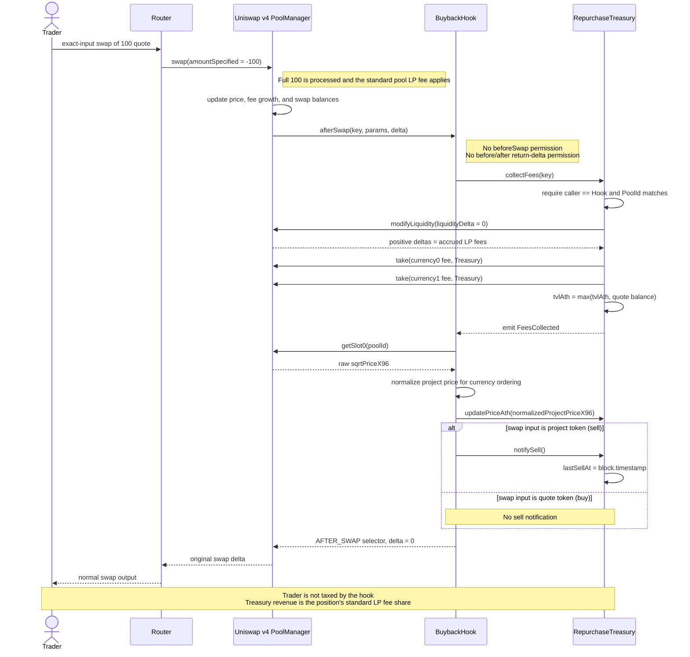
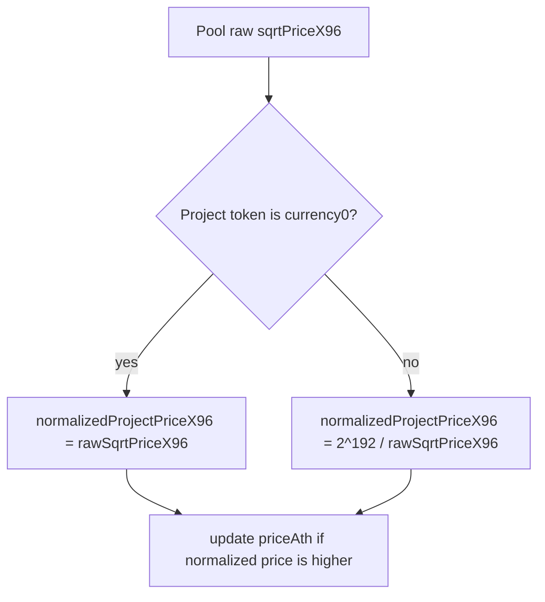
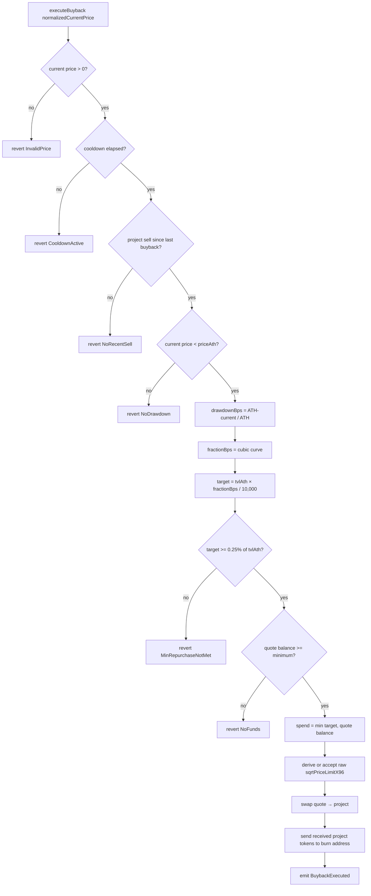
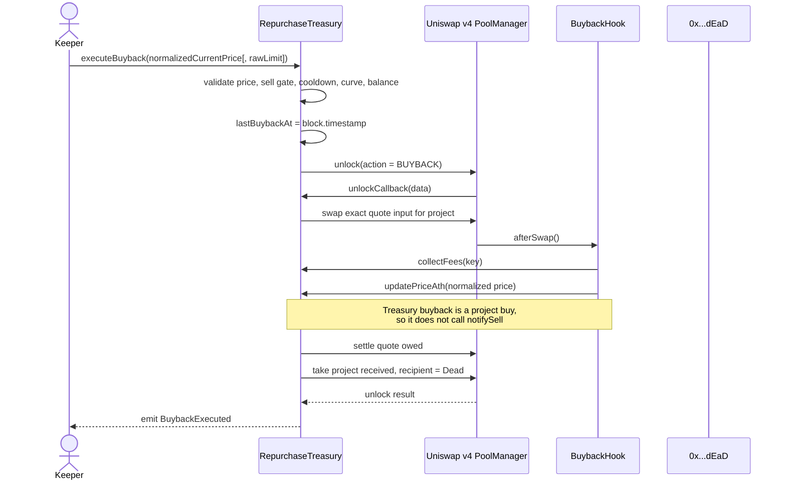
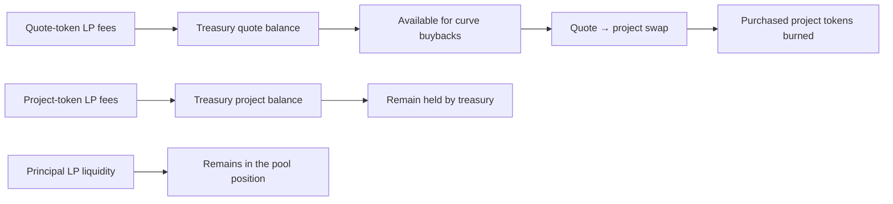
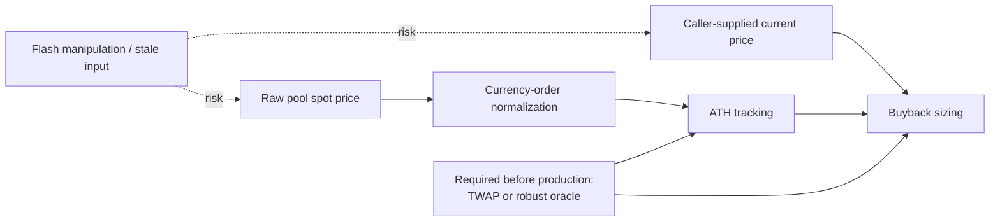

# System Diagrams

These diagrams describe the implemented flow. The hook never returns a swap delta and never takes part of a trader's input or output.

## 1. Architecture and fund ownership

### Ownership boundaries

## 2. Deployment and initialization

## 3. Treasury-owned liquidity setup

## 4. Trader swap and automatic fee collection

## 5. Currency ordering and normalized project price

Raw Uniswap price is always currency1/currency0. The strategy normalizes it so a larger value consistently means a higher project-token price.

Swap direction classification:

| Project-token position | Buy: quote → project | Sell: project → quote |
|---|---|---|
| Project is currency0 | `zeroForOne = false` | `zeroForOne = true` |
| Project is currency1 | `zeroForOne = true` | `zeroForOne = false` |

## 6. Buyback decision tree

## 7. Buyback transaction

## 8. Treasury balances after activity

## 9. Current production warning

