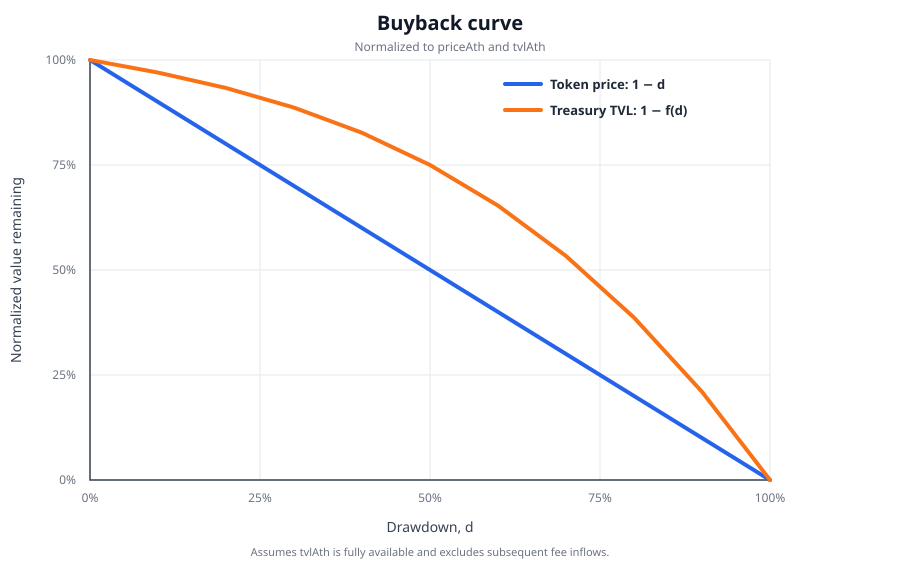

# Programmable HQ — LP-Fee-Funded Buyback Hook

A Uniswap v4 hook that leaves trader swaps untouched and funds a repurchase treasury exclusively with fees earned by a treasury-owned liquidity position. The treasury applies a continuous drawdown curve and burns the project tokens it buys back.

> **Status:** Hackathon scaffold. Not audited. Price tracking normalizes both currency orderings but still uses manipulable spot data; replace it with a robust TWAP/oracle before production.

## Contracts

| Contract | Purpose |
|----------|---------|
| `src/BuybackHook.sol` | After every swap, triggers LP-fee collection, updates the observed ATH, and reports project-token sells. It does not alter swap input or output. |
| `src/RepurchaseTreasury.sol` | Owns the direct PoolManager liquidity position, collects both fee currencies, and spends accumulated quote fees on curve-based buybacks. |
| `src/IRepurchaseTreasury.sol` | Hook-to-treasury callback interface. |

## Funding model

The treasury must own a direct Uniswap v4 `PoolManager` position identified by its configured lower tick, upper tick, and salt. The owner creates that position with `addLiquidity`. After each swap, the hook calls `collectFees`; the treasury pokes its position with `liquidityDelta = 0`, takes accrued currency0 and currency1 fees, and updates `tvlAth` from its quote-token balance.

The user's complete swap amount reaches the pool and the user receives the normal pool output. Principal liquidity is never withdrawn by fee collection. Project-token LP fees remain in the treasury; quote-token LP fees fund buybacks.

## Buyback curve

```text
drawdown = (priceAth - currentPrice) / priceAth
fraction(d) = (5/9)d^3 + (1/6)d^2 + (5/18)d
actual spend = min(fraction * tvlAth, current quote balance)
minimum spend = 0.25% of tvlAth
```



The chart plots normalized token price as `1 - d` and treasury TVL remaining after a formula-sized buyback as `1 - fraction(d)`. It assumes the full `tvlAth` is available and excludes subsequent fee inflows; in execution, spending is capped by the current quote balance.

Example points: 10% drawdown → 3%; 25% → ~8.85%; 50% → 25%; 75% → ~53.6%; 100% → 100%.

`tvlAth` is the treasury's historical peak quote-token balance, so sizing does not shrink after spending.

## Build and test

```bash
forge install
forge build
forge test -vvv
```

The suite includes unit, fuzz, and real v4 PoolManager integration tests covering both swap directions, full exact-input accounting, LP-fee collection, and principal-liquidity preservation. See **[TESTING.md](./TESTING.md)** for tests, Anvil simulations, and both demo scripts.

## Deployment

See **[DEPLOYMENT.md](./DEPLOYMENT.md)** for the real public-network procedure. The deployment script automates treasury and hook deployment, pool initialization, token approvals or native funding, initial liquidity creation, approval revocation, and position verification.

The contracts must be deployed before initializing a new pool because the hook address is part of the v4 `PoolKey`. This hook cannot be attached to an already initialized pool with a different hook. A v4 position is also keyed by its owner: liquidity must be created through `treasury.addLiquidity(...)`; a PositionManager NFT or another account's direct position does not accrue fees to this treasury.

## Frontend

```bash
cd frontend
npm install
npm run dev
```

The dashboard reads treasury state, previews the curve, and submits buybacks.

## Security requirements

- Replace caller-supplied/spot pricing with a robust TWAP for ATH and drawdown checks.
- Use a tick range aligned to `POOL_TICK_SPACING`; keep it in range if continuous fee income is expected.
- Protect owner keys and apply sensible token approval limits.
- Test ERC-20 and native-currency settlement for the target pool.
- Consider collection gas: collecting after every swap is simple but may be uneconomic for low-fee swaps.
- Add fork and invariant tests, then obtain a professional audit before production.
